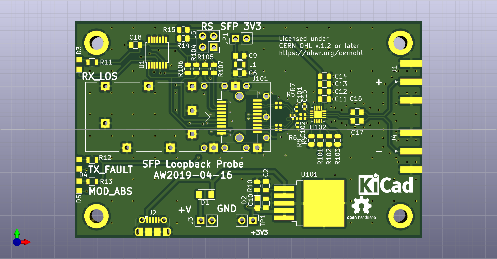

# SFP-Loopback-Board
SFP optical transciever loopback board. Connects SFP TX pins to RX pins, and provides buffered ( [ONET1191](http://www.ti.com/product/ONET1191P) )probe-outputs on SMA connectors.

See also [SFP+ timing calibration module](https://ohwr.org/project/wr-calibration/wikis/Electrical-absolute-calibration)

